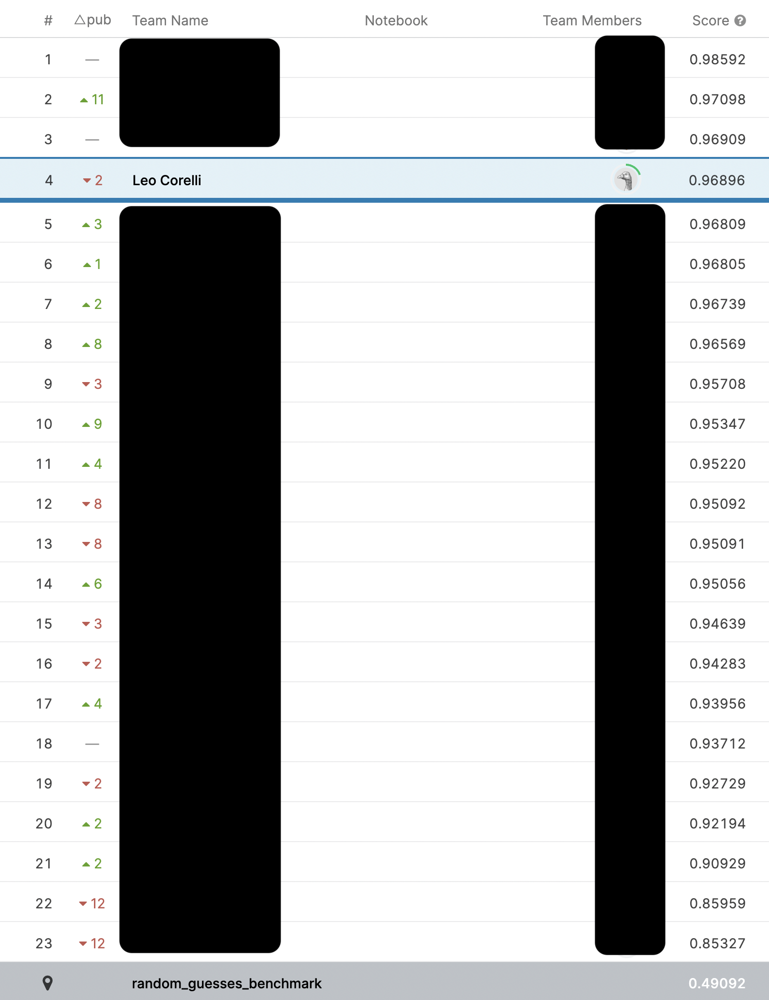
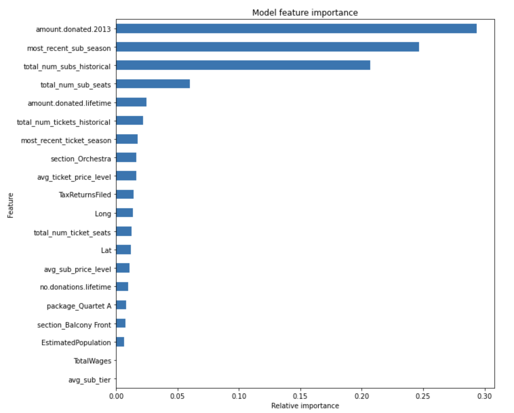
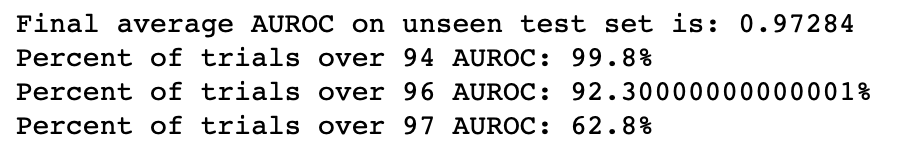

<p align="center"></p>

# My first Kaggle competition 💻
*Duke University Fall 2021 AIPI 520 Class Kaggle Competition - 4th place out of 23 students*

## Installation
1) Clone repository: ```$ git clone https://github.com/leocorelli/kaggle_fall2021.git```
2) Install requirements: ```$ pip install -r requirements.txt```

*Please ensure that you have OpenMP installed - this is a requirement to use the XGBoostClassifier. You can use ```$ brew install libomp``` after having the homebrew package manager installed. You can download homebrew at https://brew.sh/*

## Get Started
1) After completing installation instructions, you can run my main file by running ```$ python3 kaggle_driver.py```


## Project Description: 
"Our objective in this competition is to predict which previous patrons of our customer, an orchestra, will purchase a season subscription to the upcoming 2014-15 concert season. There are different levels of subscription, but we are simply going to predict whether they will purchase a subscription (of any level) or not. Our client has provided us a number of data files containing useful data on all previous patrons (see "data" folder in this repo). In this competition you will be submitting your "soft predictions" (your probabilistic prediction that they will purchase a subscription)."

"We have received several data files as described below to use in our model. Our training dataset in train.csv contains account IDs of patrons along with a target label (0 or 1) indicating whether they purchased a subscription for the 2014-15 concert season. Our objective is to predict whether the patrons listed in the test.csv file will purchase subscriptions or not. Our scoring metric for this competition is AUROC."

## Methodology:
*A lot of testing was performed in separate .ipynb files. This repository serves as an example of my final submission to the competition, but it does not include the many notebooks used to test different strategies, feature combinations, and models.*

- Data: The single most challenging part of this project was feature engineering. Many of the datasets had different entries for the same account id. This would violate our independence of observations assumption, so I addressed this by aggregating all the data for each account id. For example, if account id #7 had purchased 3 different subscriptions in their lifetime, then I extracted this information by taking the most recent year (aggregate function: maximum) that they purchased a subscription in. If this account had purchased subscription tiers 1, 3, and 4 in these three years then I extracted this information into a single entry by using aggregate function: avg for an average subscription tier of 2.67. 
- Imputation and NaNs: There were **a lot** of NaNs. I spent a lot of time comparing the performance of my model on the test set after imputing these NaNs in different ways. Ultimately, I decided to NOT impute them at all, given that XGBoost can handle NaNs as inputs. 
- Model selection: XGBoost (Extreme Gradient Boosting). One of the "state of the art" kaggle algorithms. XGBoost is a boosting ensemble model where the subsequent learner predicts the residual of the previous learner's prediction. The base estimator in this model is underfitted trees.
- Cross-validation: performed using GridSearchCV from sklearn library. I checked a very wide range of hyperparameters for my XGBoost model and selected the ones that resulted in the best cross-validation performance. 

## Results: 4th place out of 23 total participants
<p align="center"></p>

## Analysis & Discussion: 
<p align="center"></p>

The two most important features to the model were features that encoded a time element: how recently somebody had purchased a subscription/how much somebody donated recently. I think the most important data-centric approach that I could have taken to improve my model's performance would have been engineering other features that encode this strong relationship between recent purchase activity and likelihood of purchasing a ticket for the upcoming feature. For example: has this person purchased a subscription in the last 2 years? Has this person purchased a subscription in the last 4 years? 

There was a very large class imbalance in the labeled data, with a 20:1 ratio of those who did not purchase a subscription (0) in the upcoming season to those who did (1). I implemented SMOTE (synthetic minority oversampling technique) to generate synthetic positive class observations to balance the training set, however this did not improve the performance of my model. I also tried undersampling the negative (0) class to balance the training set but this did not improve my model's performance either. Ultimately I left the class imbalance as is because it resulted in the best performing model. 

I tried building all different kinds of ensembles with both voting and stacking. If I could do it again, I would implement an ensemble comprised of an adaboost with a random forest. Combining both bagging and boosting ensemble techniques together can greatly reduce the variance of the predictions and therefore "cheat" the bias-variance tradeoff -- resulting in more accurate predictions. Adaboost would have been particularly useful because it iteratively adjusts the weights of previously misclassified points. This would've been ideal for this application since ultimately my goal was to predict these cases that the model was most likely to misclassify since they are the minority class.

## Takeaways: 

Ultimately, I am really proud of my performance in my first ever kaggle competition. The main thing that I am going to walk away from this experience with is that data-centric AI is absolutely the best approach to improving performance, particularly through clever/intelligent feature engineering.

## Simulation of my model's performance over 1000 trials, with randomly split training/test data every iteration:

<p align="center"></p>


